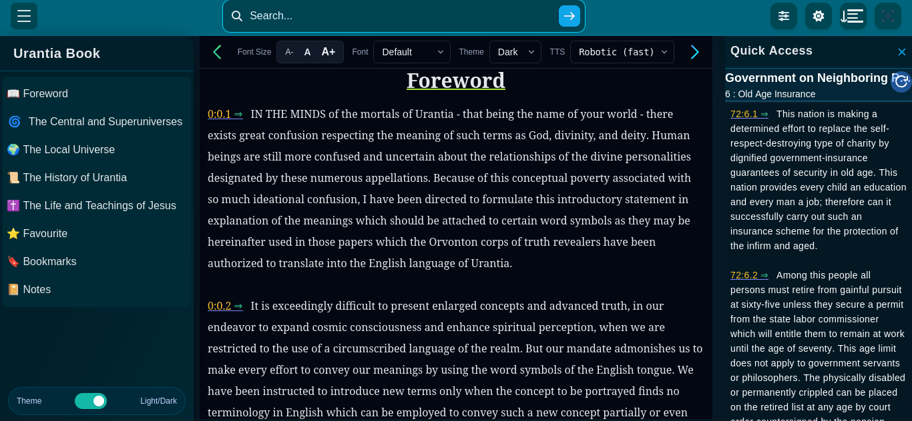
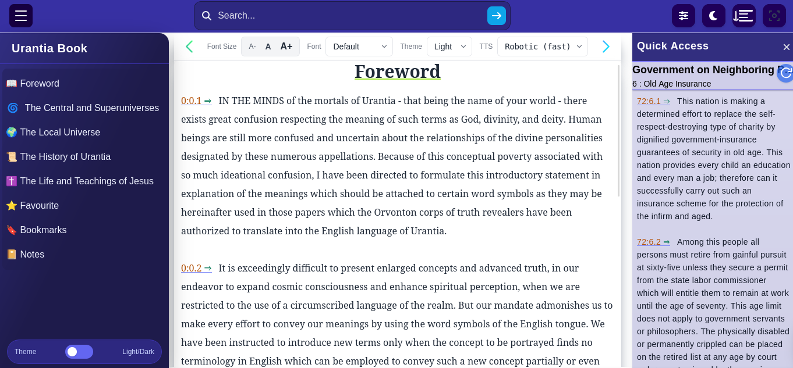
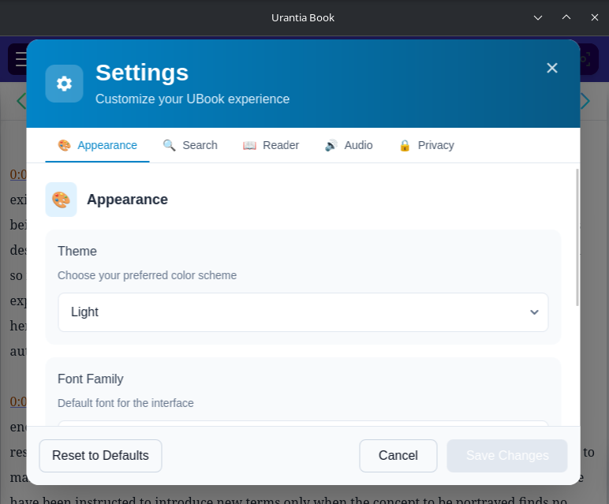
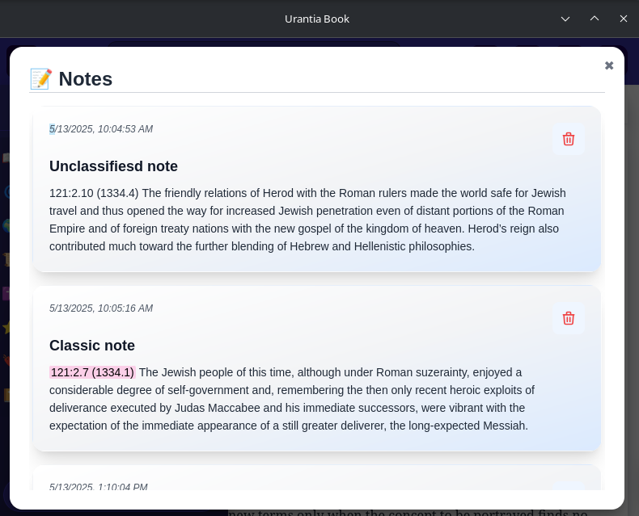

<!-- Project badges — Tauri 2 build -->
[](https://opensource.org/licenses/GPL-3.0)
[](https://tauri.app/)
[](https://www.rust-lang.org/)
[](https://nodejs.org/)
[](https://react.dev/)
[](https://github.com/skye-cyber/UrantiaBook/actions)

<!-- Platform targets -->


# Urantia Book Project

**Project Link:** [https://github.com/skye-cyber/UrantiaBook](https://github.com/skye-cyber/UrantiaBook)

---

## Table of Contents

1. [Introduction](#introduction)
2. [Features](#features)
3. [Technologies Used](#technologies-used)
4. [Installation & Setup](#installation--setup)
5. [Building for Mobile](#building-for-mobile)
6. [UI Overview](#ui-overview)
7. [Contributing](#contributing)
8. [License](#license)
9. [Acknowledgments](#acknowledgments)
10. [Future Plans](#future-plans)
11. [Contact](#contact)

---

## Introduction

UrantiaBook is a cross-platform application for reading **The Urantia Book**.
It provides a distraction-free reader with search, bookmarks, favourites,
notes, customisable typography, and text-to-speech — all usable offline,
with no network connection required after installation.

Originally built on Electron, the app was migrated to **Tauri 2** to reduce
bundle size, improve startup time, and gain first-class support for Android
and iOS from the same codebase.

## Features

- **Offline access** — the full book ships with the app; no internet needed.
- **Fast full-text search** — powered by `lunr`, indexed at build time.
- **Bookmarks** — mark any paper or section and jump back with one tap.
- **Favourites** — a separate collection for passages you revisit often.
- **Notes** — attach personal notes to any passage; view them all in one place.
- **Customisable reading** — font family, font size, light/dark themes.
- **Read aloud** — text-to-speech with a robotic (fast) and a natural (slow) engine.
- **Cross-platform** — Windows, macOS, Linux, Android, and iOS from one codebase.
- **Small binaries** — Tauri uses the OS webview instead of bundling Chromium.

## Technologies Used

| Layer | Technology |
|---|---|
| App shell | **Tauri 2** (Rust) |
| Frontend | **React 19** + **TypeScript** |
| Styling | **Tailwind CSS** + **MUI** icons |
| Bundler | **Vite** |
| Search index | **lunr** |
| Native logic | **Rust** (`src-tauri/`) |
| Persistence | JSON files under the app data directory |
| Content | Bundled JSON (Urantia Book text) |

## Installation & Setup

### Prerequisites

Install the platform toolchain for Tauri 2:

- **Rust** ≥ 1.77 — <https://rustup.rs>
- **Node.js** ≥ 22
- **Linux only**: the WebKitGTK and related system libraries

```bash
# Debian / Ubuntu
sudo apt-get install -y libwebkit2gtk-4.1-dev build-essential curl wget file \
  libxdo-dev libssl-dev libayatana-appindicator3-dev librsvg2-dev

# Fedora
sudo dnf install webkit2gtk4.1-devel openssl-devel curl wget file \
  libappindicator-gtk3-devel librsvg2-devel

# Arch
sudo pacman -S webkit2gtk-4.1 base-devel curl wget file openssl \
  libappindicator-gtk3 librsvg
```

### Clone and run

```bash
git clone https://github.com/skye-cyber/UrantiaBook.git
cd UrantiaBook
npm install
npm run dev:tauri        # launches the Tauri dev window
```

`npm run dev:tauri` starts the Vite dev server and the native Tauri window
together. Use `npm run dev:react` alone only if you're working on the UI in a
browser; Tauri commands won't be available there.

### Build for production

```bash
npm run build            # type-check + frontend + native bundle
```

Output lands in `src-tauri/target/release/bundle/`:

| Platform | Artifacts |
|---|---|
| Linux | `.deb`, `.rpm`, `.AppImage` |
| macOS | `.dmg`, `.app` |
| Windows | `.msi`, `.exe` (NSIS installer) |

To build a single format:

```bash
npm run tauri build -- --bundles deb
npm run tauri build -- --bundles appimage
npm run tauri build -- --bundles nsis
```

## Building for Mobile

Tauri 2 supports Android and iOS. Android builds work on Linux, macOS, and
Windows. **iOS builds require macOS and Xcode.**

### One-time setup

```bash
# Android
rustup target add aarch64-linux-android armv7-linux-androideabi \
  i686-linux-android x86_64-linux-android
npm run tauri android init

# iOS (macOS only)
rustup target add aarch64-apple-ios aarch64-apple-ios-sim x86_64-apple-ios
npm run tauri ios init
```

You also need the Android SDK, NDK, and a `JAVA_HOME` pointing at JDK 17+.
Install these through Android Studio's SDK Manager.

### Development

```bash
npm run tauri android dev
npm run tauri ios dev          # macOS only
```

On a physical Android device, forward the Vite dev server over USB:

```bash
adb reverse tcp:4043 tcp:4043
adb reverse tcp:1421 tcp:1421
```

The first forwards the app; the second is required for hot-reload.

### Release builds

```bash
# Android — produces an APK and an AAB
npm run tauri android build -- --apk
npm run tauri android build -- --aab

# iOS (macOS only) — produces an IPA
npm run tauri ios build
```

For release signing, create a keystore and reference it from
`src-tauri/gen/android/keystore.properties`:

```properties
storeFile=/absolute/path/to/ubook-upload-keystore.jks
storePassword=YOUR_PASSWORD
keyAlias=ubook
keyPassword=YOUR_PASSWORD
```

**Keep this keystore and its password backed up.** Losing it means you can
never update the app for existing users.

### Transferring desktop data to a phone

Your desktop data lives in `~/.UBook/`. On Android, the app stores the same
JSON files inside its private sandbox at
`/data/user/0/com.skye.ub/files/`. To copy them across:

```bash
# 1. Back up the desktop data to a staging folder on the device
adb push ~/.UBook/.favourites/fav.json /sdcard/fav.json
adb push ~/.UBook/.bookmark/bookmark.json /sdcard/bookmark.json
adb push ~/.UBook/.saveNotes/notes.json /sdcard/notes.json

# 2. Copy into the app sandbox (debug builds only; see note below)
adb shell run-as com.skye.ub cp /sdcard/fav.json /data/user/0/com.skye.ub/files/.favourites/fav.json
adb shell run-as com.skye.ub cp /sdcard/bookmark.json /data/user/0/com.skye.ub/files/.bookmark/bookmark.json
adb shell run-as com.skye.ub cp /sdcard/notes.json /data/user/0/com.skye.ub/files/.saveNotes/notes.json

# 3. Clean up
adb shell rm /sdcard/fav.json /sdcard/bookmark.json /sdcard/notes.json
```

> `run-as` only works on **debuggable** builds. For a release APK, use
> Android Studio's Device Explorer instead.

## UI Overview

1. Overview
   
   

2. Settings
   

3. Notes
   

4. Content selector
   
---
5. Mobile dark
   
6. Mobile light
   

   
## Contributing

Contributions are welcome. Open a pull request against `main` with a brief
description of what you changed and why.

Before submitting, run:

```bash
npm run type-check
npm run build:react
cd src-tauri && cargo fmt --all -- --check && cargo clippy -- -D warnings
```

The CI workflow (`.github/workflows/pr-validation.yml`) runs these same checks
on every pull request.

## License

This program is free software: you can redistribute it and/or modify it under
the terms of the **GNU General Public License** as published by the Free
Software Foundation, either version 3 of the License, or (at your option) any
later version.

This program is distributed in the hope that it will be useful, but **without
any warranty**; without even the implied warranty of merchantability or
fitness for a particular purpose. See the GNU General Public License for more
details.

You should have received a copy of the GNU General Public License along with
this program. If not, see <https://www.gnu.org/licenses/>.

See the [LICENSE](LICENSE) file for the full text.

## Acknowledgments

- Special thanks to the **Urantia Foundation** for making *The Urantia Book*
  available.
- Thanks to [cyber-ar-15 on HuggingFace](https://huggingface.co/datasets/cyber-ar-15/urantia-book-json)
  for providing the JSON dataset used to build the content bundle.

## Future Plans

- **Multi-language support** — interface translations beyond English.
- **Cross-platform TTS** — current engines are Unix-only; add Android's
  native `TextToSpeech` and Windows SAPI.
- **Audio integration** — bundled audio versions of the book.
- **Community forum** — integrated discussion threads per paper.

## Contact

For questions or suggestions, contact
[swskye17@gmail.com](mailto:swskye17@gmail.com).

