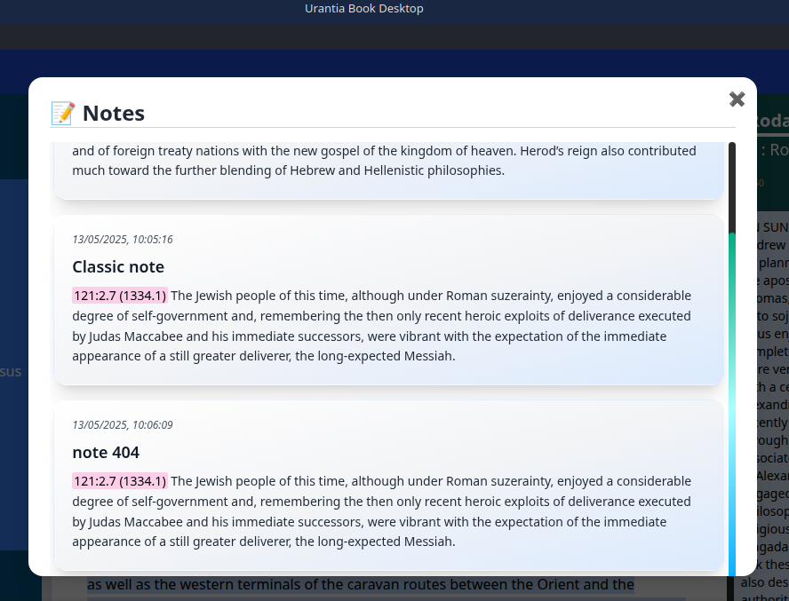

<!-- Main badges for Electron/JS app -->

<!-- Optional: If Python is a significant part of the app -->

<!-- Optional: If published to npm -->
<!--  -->
# Urantia Book Desktop App

**Project Link:** [https://github.com/skye-cyber/UBookDesktop](https://github.com/skye-cyber/UBookDesktop)

---

## Table of Contents

1. [Introduction](#introduction)
2. [Features](#features)
3. [Technologies Used](#technologies-used)
4. [Installation & Setup](#installation--setup)
5. [UI Overview](#UI-Overview)
6. [Contributing](#contributing)
7. [License](#license)
8. [Future Plans](#future-plans)
9. [Contact](#contact)

---

## Introduction
This project aims to create a desktop application for **The Urantia Book** using Electron. The app will provide a user-friendly interface to read, search, bookmark, favourite, save notes, use tts to read ,and explore the book's content.

## Features
- **Offline Access**: Users can access the book's content without an internet connection.
- **Search Functionality**: A robust search feature to find specific passages or keywords.
- **Bookmarking**: Ability to bookmark favorite sections for easy reference.
- **Notes and Annotations**: Users can add personal notes and annotations to passages.
- **Customizable Reading Experience**: Options for font size, style, and color scheme.
- **Read Aloud**: Allows pronounciation of words and text reading.

## Technologies Used
- **Electron**: For building the desktop application.
- **JavaScript**: Primary programming language.
- **HTML/CSS**: For UI design and layout.
- **JSON**: For backend operations and data management.
- **Python**: For scripting - data operations.
- **Bash**: For linux scripting.

## Installation & Setup
1. Clone the repository using `git clone https://github.com/skye-cyber/UBookDesktop.git`.
2. Navigate into the project directory with `UBookDesktop`.
3. Install dependencies using `npm install`.
4. Run the application with `npm start`.
4. Build from source `npm run dist -- --<dist e.g linux/win/macos>`.

## UI Overview
1. Foreword

2. Side Pane

3.  Full dark mode

4. Tooltip

5. Notes

6. Section Navigation

## Contributing
Contributions are welcome! Please submit a pull request with your changes and include a brief description of what you've added or fixed.

## License
This program is free software: you can redistribute it and/or modify
    it under the terms of the GNU General Public License as published by
    the Free Software Foundation, either version 3 of the License, or
    (at your option) any later version.

    This program is distributed in the hope that it will be useful,
    but WITHOUT ANY WARRANTY; without even the implied warranty of
    MERCHANTABILITY or FITNESS FOR A PARTICULAR PURPOSE.  See the
    GNU General Public License for more details.

    You should have received a copy of the GNU General Public License
    along with this program.  If not, see <https://www.gnu.org/licenses/>.
    
  See the LICENSE file for more details. See the [LICENSE](LICENSE) file for details.
  
## Acknowledgments
Special thanks to the Urantia Foundation for making **The Urantia Book** available.
Special thanks to [https://huggingface.co/datasets/cyber-ar-15/urantia-book-json](cyber-ar-15) for availing json dataset for the urantia book.

## Future Plans
- **Multi-Language Support**: Add support for multiple languages.
- **Multi-Platform Support for tts**: Current tts implementation is for unix only.
- **Audio Integration**: Include audio versions of the book for listening.
- **Community Forum**: Integrate a discussion forum for users.

## Contact
For questions or suggestions, please contact [swskye17@gmail.com](mailto:swskye17@gmail.com).
